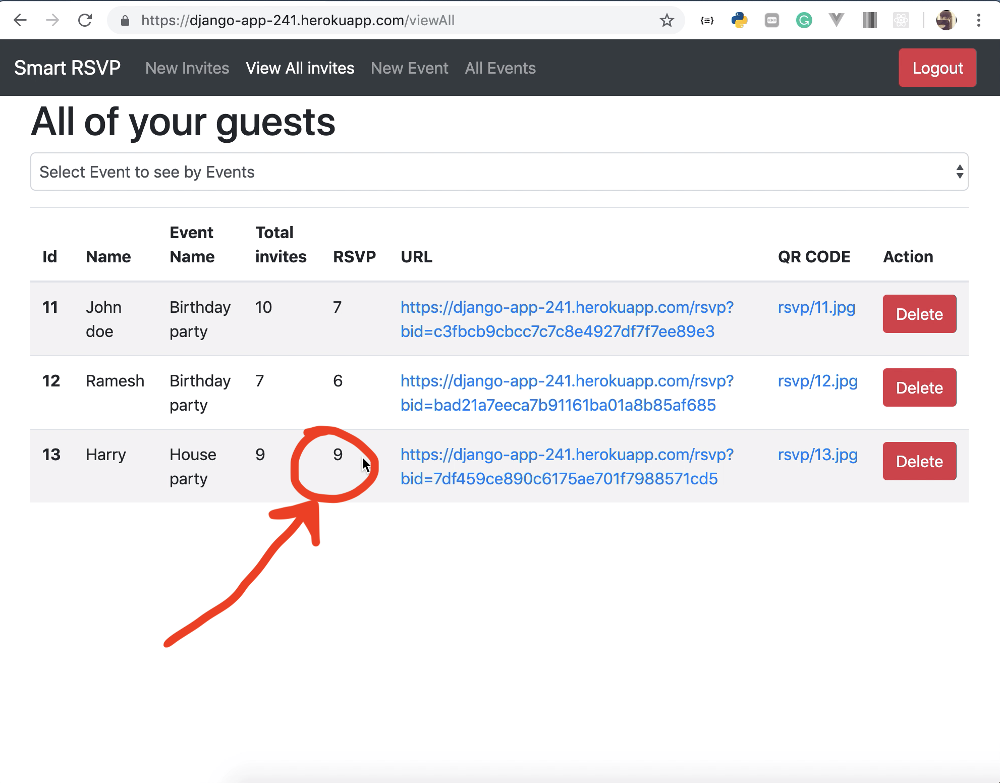

This is a Django app for RSVP
1. virtualenv myEnv
2. source ./myEnv/bin/activate
3. pip install -r requirement.txt
4. python3 manage.py runserver

Demo video: ``` res_imgs/demo.mov ``` or <a href="https://github.com/Raj1998/smart-RSVP/blob/master/res_imgs/demo.mov">here</a>

# Screenshots
## Dashboard


## Add New Event


## Add New Guest


Adding new entry generates a hash string and a QR code which is sent to the Guest, so guest can visit a unique link and update how many members from his/her family will attend the event.

Hash string is used so that no one can change other persons data without unique link or QR code.

## Before


## Guest Scanning QR code and updating the data
 

## After


## Event wise data
